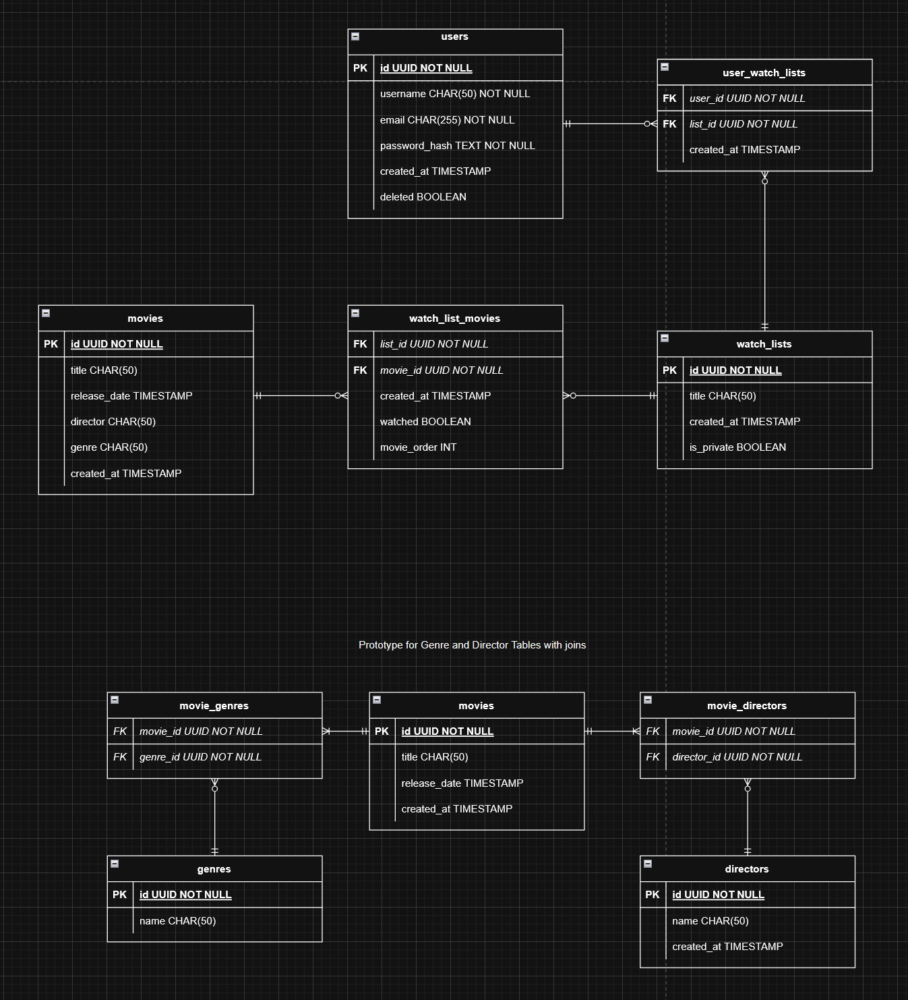

# WatchNext! - Database

## Setup database (Database)

- install postgreSQL on server
- install python (I use chocolatey on windows) and install psycopg2 with `pip install psycopg2`
- start the postgres server
- create new `.env` file based on `./database/example.env` in the same location
- run `python ./database/init.py` to setup a database and follow prompts

## Technology

- PostgreSQL
- Python
- psycopg2

## ERD Diagram

